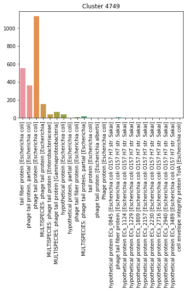

# Genomes mapping

Project for creating a total list of genes for a bacteria.

Pipeline can be run by downloading repository and executing *main.py* file. Before that, please download all the required 
python packages:
* **numpy** – pipeline uses some arrays from numpy
* **matplotlib** – plots
* **seaborn** – plots
* **pandas** – working with tables
* **tqdm** – progress bar
* **dominate** for creating html-summary

Also, please install [cd-hit](https://github.com/weizhongli/cdhit/wiki/2.-Installation) and add it to your $PATH variable, so it could be run from command line. 

File main.py executes following scripts from *./functions/*:
1. **set_enviroment.py**
2. **create_proteome.py**
3. **create_total_list_of_genes.py**
4. **make_summary.py**

All the steps, that take a lot of time have **tqdm** inside, so you can always see progress bar in your python console. 
*main.py* writes result of it's work to a file *./logs/pipeline.log*. All the steps off the pipeline described below in details.

## set_enviroment.py

Creates subdirectories needed for the other steps of the pipeline.

Directory tree after work of the pipeline will look like this (except for .py files):
```bash
    .
    ├── cd_hit - folder with cd-hit results
    ├── data - folder where all the downloaded data will be saved
    │   ├── assembly_summary.txt - table with all organism assemblies from refseq
    │   ├── GCF_000005845.2_ASM584v2 - folder with files for that assembly
    │   │   ├── GCF_000005845.2_ASM584v2_db_alignment.csv - generated by align_to_db()
    │   │   ├── GCF_000005845.2_ASM584v2_feature_table.txt - from NCBI
    │   │   ├── GCF_000005845.2_ASM584v2_genomic.fna - from NCBI
    │   │   ├── GCF_000005845.2_ASM584v2_protein.faa - from NCBI
    │   │   └── GCF_000005845.2_ASM584v2_protein.gpff - from NCBI
    │   ├── GCF_000006665.1_ASM666v1
    │   ...
    ├── logs
    │   ├── alignment.log - log of align_to_database()
    │   ├── database.log - log of create_database()
    │   ├── downloading.log - log of download_genomes()
    │   └── pipeline.log - general log
    ├── images - some images for illustration purposes
    ├── plots - folder with graphs
    └── results
        ├── proteome.faa - fasta file with all the protein coding genes from all the genomes with extra information
        ├── genes_info.tsv - data frame with following format (tab-separated):
        │       gene    info
        │       gene_1[genome:genome_1] info_1
        │       ...
        │       gene_n[genome:genome_n] info_n
        │   Information about genes is extracted from fasta header. Genome id is appended to each gene
        ├── cluster_info.json - Counter in .json format for each cluster. Counts information about genes in the cluster
        │   so you could understand, what the cluster contains.
        ├── total_list.csv - table with clusters in rows and genomes in columns. Number on the intersection means, how
        │   many genes from this cluster the genome contains.
        ├── clusters.csv - data frame with following columns:
        │   1. 'cluster' — cluster of a sequence
        │   2. 'representative' — boolean variable, which indicates, if the given sequence is representative
        │   in the cluster
        │   3. 'gene' — name of the sequence from fasta header with appended genome id
        │   4. 'length' — length of the gene's sequence
        │   5. 'identity' — identity of a sequence to representative sequence of its cluster
        │   6. 'name' — name of the sequence from fasta header without appended genome id
        │   7. 'genome' — genome id from fasta header
        │   8. 'info' — information about gene from its fasta header
        └── summary.txt - summary about results
```

## download_genomes.py
Downloads *assembly_summary.txt* from NCBI ftp-site to *./data* folder. For example, for Escherichia coli the file will be downloaded from ftp://ftp.ncbi.nlm.nih.gov/genomes/refseq/bacteria/Escherichia_coli/ . 
If you want to use another organism, please set it's name to **ORGANISM** constant in *./constants.py*.

Then, only assemblies with **assembly_level** "Complete Genome" or "Chromosome" are selected. For each of them 
the following files will be downloaded:
* **protein.faa.gz** – contains amino acid sequences.
* **feature_table.txt.gz** – contains information about genes, i.e, *start* and *end* in a genome.
* **genomic.fna.gz** – complete nucleotide sequence of a genome.
* **protein.gpff.gz** – protein sequence and annotation for each gene.
Then all the files are extracted from their archives.

Information about the work process of the function is being written to *./logs/downloading.log*.

## create_proteome.py

Creates one fasta file with protein sequences from all the genomes in *./data/* folder. File format has some extra information in header, making it easier for the following analysis. Example of some sequences in the file:
```
>WP_000002298.1[genome:GCF_002741575.1_ASM274157v1_]  MULTISPECIES: alpha-D-ribose 1-methylphosphonate 5-phosphate C-P-lyase [Enterobacteriaceae] [start:4548948] [end:4549793] [genome:GCF_002741575.1_ASM274157v1_] 
MANLSGYNFAYLDEQTKRMIRRAILKAVAIPGYQVPFGGREMPMPYGWGTGGIQLTASVIGESDVLKVIDQGADDTTNAVSIRNFFKRVTGVNTTERTDDATLIQTRHRIPETPLTEDQIVIFQVPIPEPLRFIEPRETETRTMHALEEYGVMQVKLYEDIARFGHIATTYAYPVKVNGRYVMDPSPIPKFDNPKMDMMPALQLFGAGREKRIYAVPPFTRVESLDFDDHPFTVQQWDEPCAICGSTHSYLDEVVLDDAGNRMFVCSDTDYCRQQSEAKNQ
>WP_000002474.1[genome:GCF_002741575.1_ASM274157v1_]  MULTISPECIES: transcriptional regulator [Proteobacteria] [start:731039] [end:731941] [genome:GCF_002741575.1_ASM274157v1_] 
MANLYDLKKFDLNLLVIFECIYQHLSISKAAESLYITPSAVSQSLQRLRAQFNDPLFIRSGKGIAPTTTGLNLHHHLEKNLRGLEQTINIVNKSELKKNFIIYGPQLISCSNNSMLIRCLRQDSSVEIECHDILMSAENAEELLVHRKADLVITQMPVISRSVICMPLHTIRNTLICSNRHPRITDNSTYEQIMAEEFTQLISKSAGVDDIQMEIDERFMNRKISFRGSSLLTIINSIAVTDLLGIVPYELYNSYRDFLNLKEIKLEHPLPSIKLYISYNKSSLNNLVFSRFIDRLNESF
>WP_000002542.1[genome:GCF_002741575.1_ASM274157v1_]  MULTISPECIES: S26 family signal peptidase [Enterobacteriaceae] [start:2854078] [end:2855052] [genome:GCF_002741575.1_ASM274157v1_] 
MANMFALILVIATLVTGILWCVDKFFFAPKRRERQAAAQAAAGDSLDKATLKKVAPKPGWLETGASVFPVLAIVLIVRSFIYEPFQIPSGSMMPTLLIGDFILVEKFAYGIKDPIYQKTLIETGHPKRGDIVVFKYPEDPKLDYIKRAVGLPGDKVTYDPVSKELTIQPGCSSGQACENALPVTYSNVEPSDFVQTFSRRNGGEATSGFFEVPKNETKENGIRLSERKETLGDVTHRILTVPIAQDQVGMYYQQPGQQLATWIVPPGQYFMMGDNRDNSADSRYWGFVPEANLVGRATAIWMSFDKQEGEWPTGVRLSRIGGIH
```
Gene IDs are concatenated with genome IDs. It helps to distinguish genes with the same name after CD-hit clustering. Also information about **start**, **end**, and **genome** of each gene is written in square brackets. File can be found in *./results/proteome.faa*.

This function also creates *./results/genes_info.tsv* file. It is a tab-separated table with two columns: **gene** and **info**. Information is extracted from fasta files headers. For sequences above the file will look like this:
```
gene	info
WP_000002298.1[genome:GCF_002741575.1_ASM274157v1_]	MULTISPECIES: alpha-D-ribose 1-methylphosphonate 5-phosphate C-P-lyase [Enterobacteriaceae]
WP_000002474.1[genome:GCF_002741575.1_ASM274157v1_]	MULTISPECIES: transcriptional regulator [Proteobacteria]
WP_000002542.1[genome:GCF_002741575.1_ASM274157v1_]	MULTISPECIES: S26 family signal peptidase [Enterobacteriaceae]
```

Information about the work process of the function is being written to *./logs/proteome.log*

## create_total_list_of_genes.py

This function does couple of things:

1. Performs CD-hit clustering. Threshold can be changed by setting **THRESHOLD** constant in *./constants.py*. By default it is **90**. CD-hit output files are being saved in *./cd_hit* folder. You don't have to look at them though, because they are being processed and saved in convenient form in *./results/clusters.csv*. This table contains following columns:
    * **cluster** — cluster of a sequence
    * **representative** — boolean variable, which indicates, if the given sequence is representative in the cluster
    * **gene** — name of the sequence from fasta header with appended genome id
    * **length** — length of the gene's sequence
    * **identity** — identity of a sequence to representative sequence of its cluster
    * **name** — name of the sequence from fasta header without appended genome id
    * **genome** — genome id from fasta header
    * **info** — information about gene from its fasta header 
   
For example:

| cluster   | representative | gene | length | identity | name | genome | info|
| --------- |:--------------:|:----:|:------:|:--------:|:----:|:------:| -----:|
| Cluster 0 | False | WP_000052493.1[genome:GCF_001558995.2_ASM155899v2_] | 1461 | 96.99 | WP_000052493.1 | GCF_001558995.2_ASM155899v2_ | Ig-like domain repeat protein [Escherichia coli] |
| Cluster 0 | False | WP_001693637.1[genome:GCF_001890225.1_ASM189022v1_] | 1461 | 96.99 | WP_001693637.1 | GCF_001890225.1_ASM189022v1_ | Ig-like domain [Escherichia coli] |
| Cluster 0 | False | WP_000052468.1[genome:GCF_001612495.1_ASM161249v1_] | 1461 | 97.06 | WP_000052468.1 | GCF_001612495.1_ASM161249v1_ | Ig-like domain repeat protein [Escherichia coli] |
| Cluster 0 | True | WP_021523017.1[genome:GCF_003031795.1_ASM303179v1_] | 6925 | 100.0 | WP_021523017.1 | GCF_003031795.1_ASM303179v1_ | MULTISPECIES: Ig-like domain repeat protein [Enterobacteriaceae] |

2. For each cluster it counts the information in **info** column. Result (python collections.Counter object) is being saved in *./results/cluster_info.json*. You can use it do understand a structure of the cluster and to give the clusters readable name. Here's example of visualisation of information about 1 cluster:

 

3. Creates a total list of genes. It is the table with clusters in rows and genomes in columns. Number on the intersection means, how many genes from this cluster the genome contains. It is being saved in *./results/total_list.csv*

Information about the work process of the function is being written to *./logs/total_list.log*

## make_summary.py

Creates plots and html summary of the process.

If you had any problems with that tool or have any notes, please contact [vladimirshitov98@gmail.com](mailto:vladimirshitov98@gmail.com)
